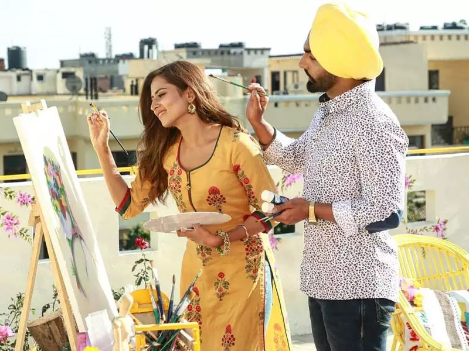
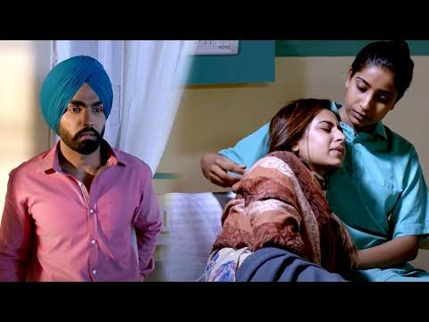

I've watched Qismat at least five times now. I've lost count, actually, which probably means it's more than five.

Every time I press play, I tell myself the same thing — *I already know what happens, this time I won't cry.* And every single time, I'm wrong.

If you haven't seen it, don't worry. You don't need to know a single Punjabi word to understand what this movie is really about. It's about that one person, that one feeling, that one "what if" — and everyone, everywhere, has felt some version of that.

## How it starts

Shiva comes to Chandigarh with one plan: have fun, waste some time, enjoy his last bit of freedom before his family marries him off to someone he's never even met. Very relatable energy, honestly. Half of us have made plans like that right before something "responsible" was about to happen to our lives.

Except Shiva's plan falls apart the moment he meets Bani.

She's lively, modern, funny, and nothing like the quiet arranged-marriage life waiting for him back home. And of course — of course — he falls for her.

*This isn't an actual movie still — just a placeholder standing in for the "happy scene" until I add a real screenshot.*

This is the part of the movie where everything feels light. The songs during this stretch are genuinely some of the best I've heard in any film — the kind you catch yourself humming three days later without even meaning to. They don't just play in the background either; they carry the whole mood of falling for someone, which honestly does most of the emotional work before the story even asks you to feel anything.

## Then life happens

Bani's father wants her to have an arranged marriage. Not because he's a villain — because she's already been hurt once before, and he's scared for her. Which, if you think about it, is a very human, very unfair thing that parents do out of love sometimes: protect you so hard that they end up standing between you and the thing that might actually make you happy.

Shiva and Bani keep getting pulled closer and pushed apart in that maddening way real life does. He eventually goes back to his village. You'd think that's the end of it.

It's not. Fate — *qismat* — pulls them back together anyway, and this time it feels like something neither of them can walk away from, even though everyone around them keeps insisting they should.

## Where it breaks your heart

I won't spoil exactly how it ends, but I'll tell you this much — keep tissues nearby. Bani's health declines when circumstances force them apart, and the movie's whole message lands hard in its last stretch: sometimes love isn't the problem. Timing is. Fate is. The things you can't control are.

*Again — not a real movie still, just a mood placeholder for the "sad scene."*

I know exactly what's coming every time I hit play. I know the ending. I still somehow end up sitting there, staring at the screen, feeling like it happened to me.

## Why I keep watching it

Here's the honest part: I don't rewatch Qismat because I forgot the story. I rewatch it because some weeks are hard, and this movie gives me somewhere else to put that feeling for two hours. It's easier to cry over Shiva and Bani than to sit with whatever's actually bothering me that day. And somehow, by the time the credits roll, I feel lighter — like the movie borrowed my heaviness for a while and gave me back something softer.

That's the strange thing about a good sad movie. It doesn't add to your pain. It gives it somewhere to go.

So yes — I've watched it five times. I'll probably watch it a sixth. And I already know I'll cry again, right on schedule, at exactly the same scene.

I'm okay with that.
